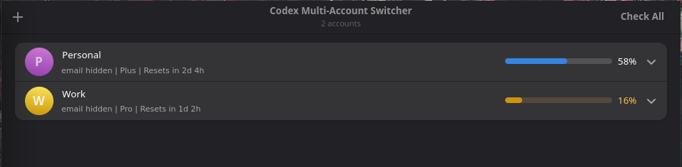

# Codex Account Switcher

GTK/libadwaita app for managing multiple ChatGPT accounts for Codex CLI.



Codex Account Switcher uses OpenAI's browser-based OAuth flow to add ChatGPT accounts without API keys. It checks Codex usage for each account, shows how much quota is left, shows when limits reset, and can write the selected account to Codex CLI's `~/.codex/auth.json`.

## Features

- Add ChatGPT accounts through OpenAI OAuth.
- See remaining Codex usage at a glance.
- Check when each account's usage window resets.
- Switch the active Codex CLI account without manually editing auth files.
- Keep last-known usage visible between app restarts.

## Build

```sh
meson setup build --prefix /usr
meson compile -C build
meson install -C build
```

## Release archive

```sh
./scripts/build-release-archive.sh 0.2.2
```

## Development Log

This section is the short version of what changed and why. It is meant as a study note for the repo history, not just a release note.

### Early app work

- `3d92b4c` started the project as a multi-account OAuth PKCE app.
- `66c7b99` moved the account cards from `FlowBox` to `Adw.PreferencesPage` with `Adw.ExpanderRow`.
- `656b1d9` added "Use in Codex" support and changed the layout to a wider, scrollable presentation.
- `ca02d15` enabled a header bar title and removed decoration layout settings.

### First AUR packaging pass

- `7093b26` added the initial AUR release packaging.
- `dfc4ab4` pinned the AUR release checksum instead of leaving it as `SKIP`.
- `dd1ea43` ignored package artifacts so build output would not pollute the repo.

### App rename and UI fixes

- `6cb4f46` renamed the app to Codex Account Switcher.
- That same change added an active account indicator and fixed a toast crash.

### Release and packaging bugs we hit

- The release archive name originally drifted from the app rename. The archive stem and license install path were aligned in `scripts/build-release-archive.sh` so the artifact now uses `codex-account-switcher-<version>-<arch>.tar.zst`.
- The AUR package name also changed during the repo rename. It now lives at `packaging/aur/codex-account-switcher-bin`, which matches the current GitHub repo name plus the normal `-bin` suffix for prebuilt packages.
- The AUR metadata initially pointed at the old repository URL. `PKGBUILD` and `.SRCINFO` were updated to use `https://github.com/jR4dh3y/codex-account-switcher`.
- The first AUR sync job failed because the workflow used a third-party deploy action that broke on the current Arch runner image with `bash: --command: invalid option`. The workflow now clones or initializes the AUR repo directly over SSH and commits `PKGBUILD` and `.SRCINFO` itself.
- The `.SRCINFO` update step also had a bug: the `sed` patterns assumed no leading indentation, but `.SRCINFO` fields are tab-indented. That meant `pkgver` and `sha256sums` were not being updated correctly. The workflow now matches leading whitespace explicitly.
- The AUR deploy path now falls back cleanly if the package repo does not already exist on AUR. That matters when the package is renamed or published for the first time under a new name.

### Current state

- GitHub remote: `jR4dh3y/codex-account-switcher`
- AUR package: `codex-account-switcher-bin`
- Release archive: `codex-account-switcher-<version>-x86_64.tar.zst`
- Current release tag: `v0.2.2`

### Release flow

1. Bump `project(version:)` in `meson.build`.
2. Push a matching tag such as `v0.2.2`.
3. GitHub Actions builds `codex-account-switcher-<version>-x86_64.tar.zst` and uploads it with its `.sha256` file.
4. The workflow updates the AUR `PKGBUILD` and `.SRCINFO`.
5. The workflow pushes the updated package metadata to the AUR repo `codex-account-switcher-bin`.
